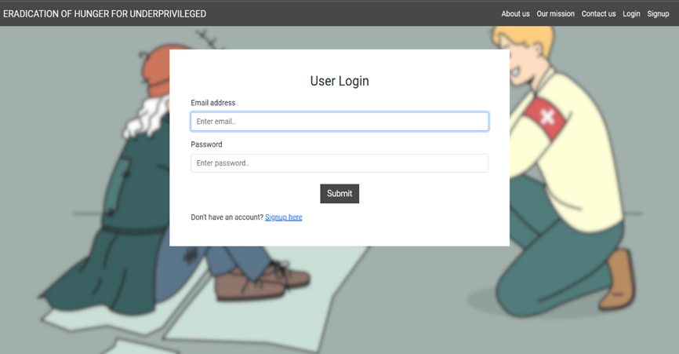
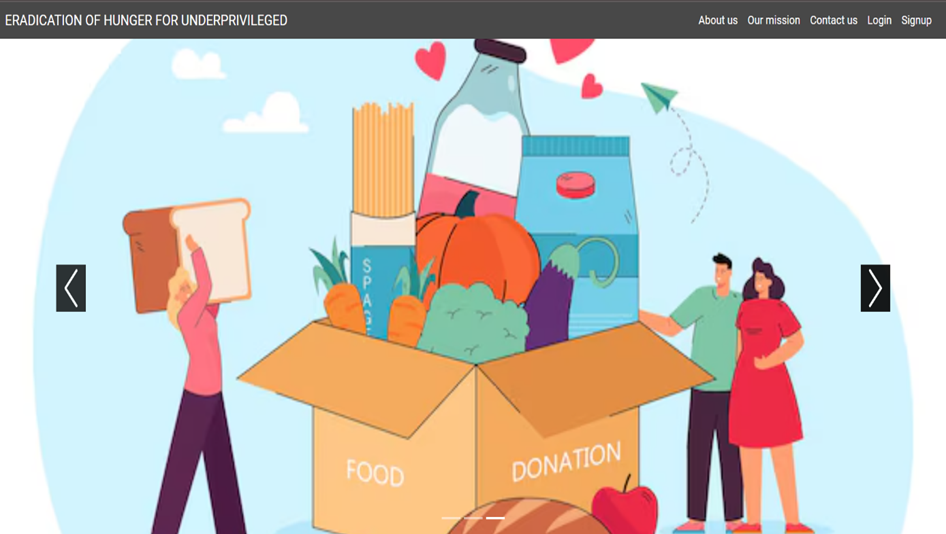
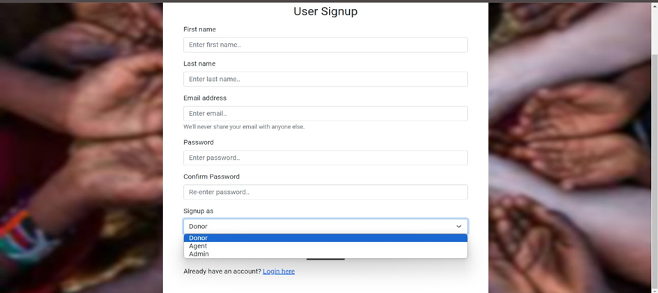
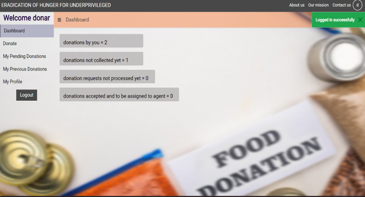
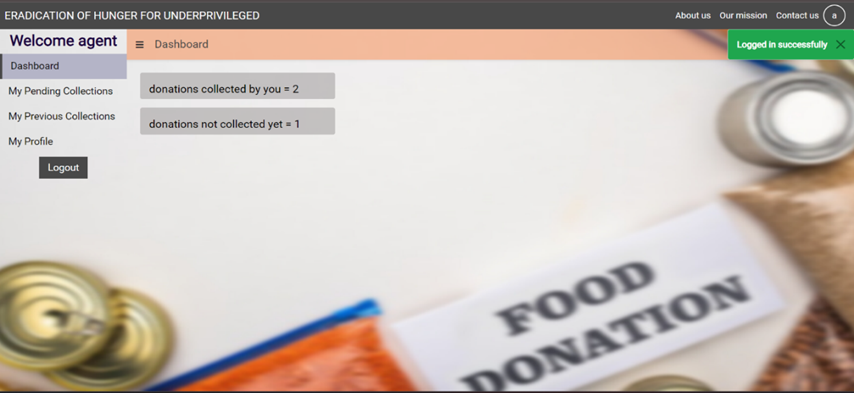
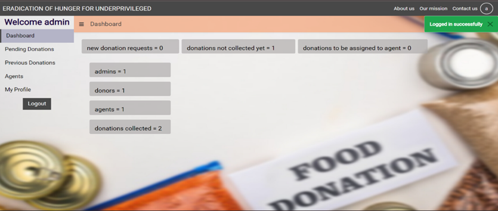

# 🍱 ERADICATION OF HUNGER FOR UNDERPRIVILEGED

A web application designed to manage food donation and collection activities, connecting donors, agents, and administrators in a streamlined platform.

[🔗 View Demo](https://food-aid.onrender.com/)


## 📚 Table of Contents

- [Installation and Setup](#installation-and-setup)
- [Features](#features)
- [Technologies Used](#technologies-used)
- [npm Packages Used](#npm-packages-used)
- [Prerequisites](#prerequisites)
- [Useful Links](#useful-links)
- [Contact](#contact)

## ⚙️ Installation and Setup

1. Install all dependencies:
   ```sh
   npm install
   ```
2. Create a `.env` file with the following credentials:
   ```env
   MONGO_URI=yourmongouri
   ```
3. Run the application:
   ```sh
   npm start
   ```
4. Open [http://localhost:5000](http://localhost:5000)
5. Signup and login to access the application.

## 🖼️ Application Screenshots

### 🔐 Login Page


### 🏠 Home Page


### 👤 Register Page


### 👤 Donor Module


### 🧍 Agent Module


### 👨‍💼 Admin Module



### General
- Three user roles: Admin, Donor, and Agent.
- Each user has a dashboard for quick summary access.
- Signup, login, logout functionalities.

### Donor
- Submit donation requests with food details.
- Track donation request status (accepted/rejected).
- View current and past donations.
- Update profile.

### Admin
- View all donor requests.
- Accept/reject donation requests.
- Assign agents to approved donations.
- Track all pending and processed donations.
- View and manage all agents.
- Update profile.

### Agent
- Receive donation collection assignments from Admins.
- Mark collections as completed.
- View collection history.
- Update profile.

## 🛠 Technologies Used

- HTML, CSS, Bootstrap
- JavaScript
- Node.js, Express.js
- MongoDB, Mongoose
- EJS templating

## 📦 npm Packages Used

- express
- ejs
- express-ejs-layouts
- mongoose
- express-session
- bcryptjs
- passport
- passport-local
- connect-flash
- method-override
- dotenv

## ✅ Prerequisites

- Node.js installed
- MongoDB instance or Atlas account
- VS Code or preferred code editor

## 🔗 Useful Links

- 🌐 [Demo](https://food-aid.onrender.com/)
- 📦 [Node.js](https://nodejs.org/)
- 📝 [VS Code](https://code.visualstudio.com/)
- 📚 [w3schools](https://www.w3schools.com/)
- 📘 [npm Docs](https://docs.npmjs.com/)
- 📘 [Express Docs](https://expressjs.com/)
- 🎨 [Bootstrap Docs](https://getbootstrap.com/docs/5.1/getting-started/introduction/)
- 🔗 [Mongoose Docs](https://mongoosejs.com/docs/index.html)
- ☁️ [MongoDB Atlas](https://www.mongodb.com/cloud/atlas/register)
- 📖 [MongoDB Manual](https://docs.mongodb.com/manual/introduction/)
- 📧 [Nodemailer](https://nodemailer.com/)
- 🧰 [GitHub Docs](https://docs.github.com/en/get-started/quickstart/hello-world)
- 📝 [Git Cheat Sheet](https://education.github.com/git-cheat-sheet-education.pdf)
- 🎹 [VS Code Shortcuts](https://code.visualstudio.com/shortcuts/keyboard-shortcuts-windows.pdf)

## 📬 Contact

For any queries, contact the project contributors:

- M. Vinutna
- M. Sathwika
- R. Pranavi
- T. Aarthi
- P. Sathwika
